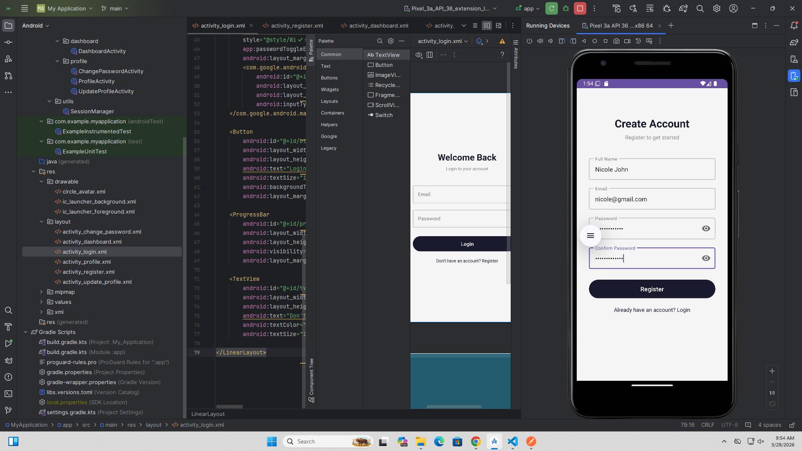
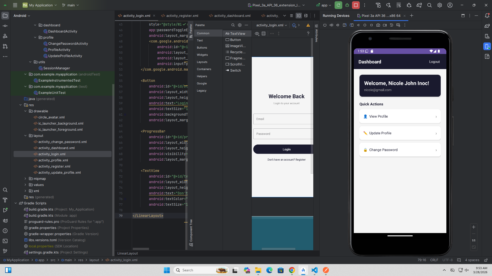
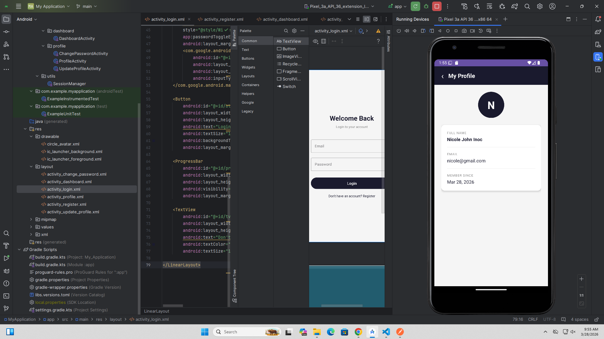
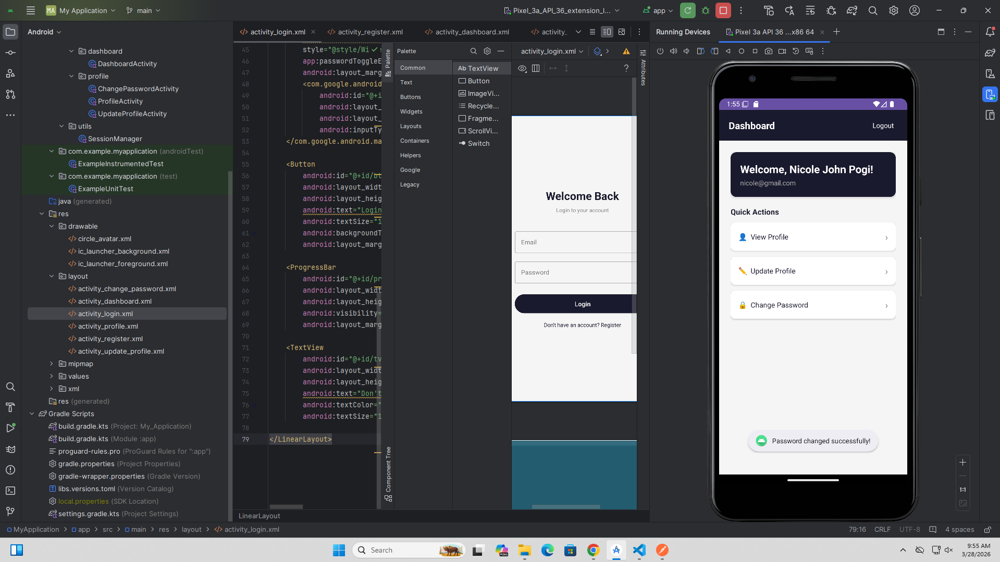
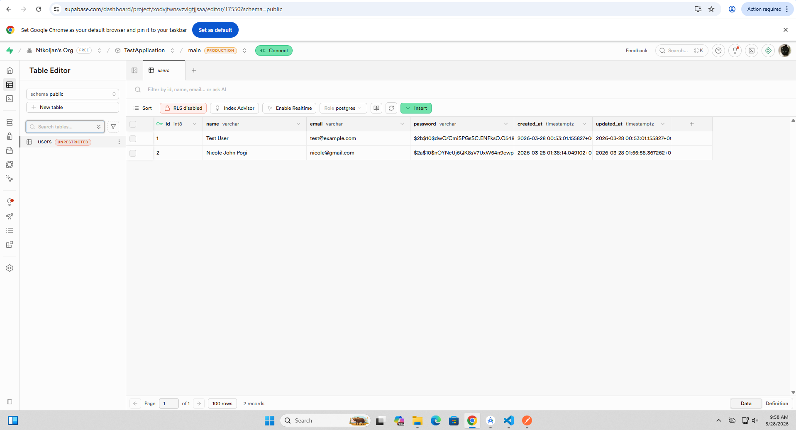

# 📱 MyApplication — Android API Integration

An Android application built with **Kotlin** that integrates with a live REST API backend (Node.js + Supabase + Render) implementing full user authentication and profile management.

---

## 🔗 Links

- **GitHub Repository:** https://github.com/N1koljan/android-api-integration-skill-exchange
- **Live API Base URL:** `https://my-api-w7kl.onrender.com/api/`

---

## ✨ Features

- ✅ User Registration
- ✅ User Login with Bearer Token Authentication
- ✅ Dashboard with Welcome Message
- ✅ View Profile
- ✅ Update Profile (Name & Email)
- ✅ Change Password
- ✅ Logout
- ✅ Session Management with SharedPreferences
- ✅ Error Handling (Network, Server, Validation)

---

## 📸 Screenshots

### 🔐 Register
> Create a new account with name, email, and password.



---

### 🔑 Login
> Login with your email and password to access the app.


---

### 🏠 Dashboard
> Welcome screen showing user info and quick action cards.



---

### 👤 Profile
> View your full profile details including name, email, and member since date.



---

### ✏️ Update Profile
> Edit your name and email address.


---

### 🔒 Change Password
> Securely change your account password.



---

### 🗄️ Database (Supabase)
> Users table in Supabase showing registered accounts with hashed passwords.



---

## 🌐 API Documentation

**Base URL:** `https://my-api-w7kl.onrender.com/api/`

> ⚠️ This API is hosted on Render's free tier. The first request may take **50+ seconds** to wake up the server.

---

### 📌 Endpoints

#### 1. Register
| | |
|---|---|
| **Method** | `POST` |
| **URL** | `/api/register` |
| **Auth** | ❌ Not required |

**Request Body:**
```json
{
  "name": "John Doe",
  "email": "john@example.com",
  "password": "secret123",
  "password_confirmation": "secret123"
}
```

**Success Response (200):**
```json
{
  "success": true,
  "message": "Registration successful",
  "token": "eyJhbGciOiJIUzI1NiIs...",
  "user": {
    "id": 1,
    "name": "John Doe",
    "email": "john@example.com",
    "created_at": "2026-03-28T00:00:00.000Z"
  }
}
```

**Error Responses:**
| Code | Reason |
|------|--------|
| 400 | Missing fields / Passwords don't match / Email already registered |
| 500 | Server error |

---

#### 2. Login
| | |
|---|---|
| **Method** | `POST` |
| **URL** | `/api/login` |
| **Auth** | ❌ Not required |

**Request Body:**
```json
{
  "email": "john@example.com",
  "password": "secret123"
}
```

**Success Response (200):**
```json
{
  "success": true,
  "message": "Login successful",
  "token": "eyJhbGciOiJIUzI1NiIs...",
  "user": {
    "id": 1,
    "name": "John Doe",
    "email": "john@example.com",
    "created_at": "2026-03-28T00:00:00.000Z"
  }
}
```

**Error Responses:**
| Code | Reason |
|------|--------|
| 400 | Missing email or password |
| 401 | Invalid email or password |
| 500 | Server error |

---

#### 3. Dashboard
| | |
|---|---|
| **Method** | `GET` |
| **URL** | `/api/dashboard` |
| **Auth** | ✅ Bearer Token required |

**Headers:**
```
Authorization: Bearer <token>
```

**Success Response (200):**
```json
{
  "success": true,
  "message": "Dashboard loaded",
  "data": {
    "welcome_message": "Welcome, John Doe!",
    "user": {
      "id": 1,
      "name": "John Doe",
      "email": "john@example.com",
      "created_at": "2026-03-28T00:00:00.000Z"
    }
  }
}
```

**Error Responses:**
| Code | Reason |
|------|--------|
| 401 | Unauthorized / Invalid token |
| 500 | Server error |

---

#### 4. Get Profile
| | |
|---|---|
| **Method** | `GET` |
| **URL** | `/api/profile` |
| **Auth** | ✅ Bearer Token required |

**Headers:**
```
Authorization: Bearer <token>
```

**Success Response (200):**
```json
{
  "success": true,
  "user": {
    "id": 1,
    "name": "John Doe",
    "email": "john@example.com",
    "created_at": "2026-03-28T00:00:00.000Z",
    "updated_at": "2026-03-28T00:00:00.000Z"
  }
}
```

**Error Responses:**
| Code | Reason |
|------|--------|
| 401 | Unauthorized |
| 500 | Server error |

---

#### 5. Update Profile
| | |
|---|---|
| **Method** | `PUT` |
| **URL** | `/api/profile/update` |
| **Auth** | ✅ Bearer Token required |

**Headers:**
```
Authorization: Bearer <token>
```

**Request Body:**
```json
{
  "name": "Jane Doe",
  "email": "jane@example.com"
}
```

**Success Response (200):**
```json
{
  "success": true,
  "message": "Profile updated successfully"
}
```

**Error Responses:**
| Code | Reason |
|------|--------|
| 400 | Missing name or email / Email already in use |
| 401 | Unauthorized |
| 500 | Server error |

---

#### 6. Change Password
| | |
|---|---|
| **Method** | `PUT` |
| **URL** | `/api/profile/change-password` |
| **Auth** | ✅ Bearer Token required |

**Headers:**
```
Authorization: Bearer <token>
```

**Request Body:**
```json
{
  "current_password": "oldpassword",
  "new_password": "newpassword123",
  "new_password_confirmation": "newpassword123"
}
```

**Success Response (200):**
```json
{
  "success": true,
  "message": "Password changed successfully"
}
```

**Error Responses:**
| Code | Reason |
|------|--------|
| 400 | Missing fields / Passwords don't match |
| 401 | Current password incorrect |
| 500 | Server error |

---

#### 7. Logout
| | |
|---|---|
| **Method** | `POST` |
| **URL** | `/api/logout` |
| **Auth** | ✅ Bearer Token required |

**Headers:**
```
Authorization: Bearer <token>
```

**Success Response (200):**
```json
{
  "success": true,
  "message": "Logged out successfully"
}
```

---

## 🏗️ Project Structure

```
app/
└── src/main/java/com/example/myapplication/
    ├── api/
    │   ├── ApiService.kt          # Retrofit API interface
    │   └── RetrofitClient.kt      # Retrofit instance + OkHttp client
    ├── models/
    │   └── Models.kt              # Request & Response data classes
    ├── ui/
    │   ├── auth/
    │   │   ├── LoginActivity.kt
    │   │   └── RegisterActivity.kt
    │   ├── dashboard/
    │   │   └── DashboardActivity.kt
    │   └── profile/
    │       ├── ProfileActivity.kt
    │       ├── UpdateProfileActivity.kt
    │       └── ChangePasswordActivity.kt
    └── utils/
        └── SessionManager.kt      # SharedPreferences token/user storage
```

---

## ⚙️ Tech Stack

| Layer | Technology |
|-------|-----------|
| Language | Kotlin |
| Architecture | Activity-based (View Binding) |
| Networking | Retrofit 2.9.0 + OkHttp |
| Serialization | Gson |
| Auth | JWT Bearer Token |
| Local Storage | SharedPreferences |
| Backend | Node.js + Express |
| Database | Supabase (PostgreSQL) |
| Hosting | Render (free tier) |

---

## 🚀 Getting Started

### Prerequisites
- Android Studio Hedgehog or newer
- Android SDK 24+
- Internet connection

### Installation

1. **Clone the repository:**
```bash
git clone https://github.com/N1koljan/android-api-integration-skill-exchange.git
```

2. **Open in Android Studio:**
   - File → Open → select the project folder

3. **Sync Gradle:**
   - Click **Sync Now** when prompted

4. **Run the app:**
   - Connect a device or start an emulator
   - Click ▶ Run

---

## 📦 Dependencies

```gradle
// Retrofit
implementation 'com.squareup.retrofit2:retrofit:2.9.0'
implementation 'com.squareup.retrofit2:converter-gson:2.9.0'

// OkHttp Logging
implementation 'com.squareup.okhttp3:logging-interceptor:4.12.0'

// Coroutines
implementation 'org.jetbrains.kotlinx:kotlinx-coroutines-android:1.7.3'

// Lifecycle
implementation 'androidx.lifecycle:lifecycle-viewmodel-ktx:2.7.0'
implementation 'androidx.lifecycle:lifecycle-runtime-ktx:2.7.0'

// CardView
implementation 'androidx.cardview:cardview:1.0.0'
```

---

## 🔐 Authentication Flow

```
User opens app
     │
     ▼
Is token saved? ──Yes──▶ Go to Dashboard
     │
     No
     ▼
Login Screen
     │
     ▼
POST /api/login
     │
     ▼
Save token + user info (SharedPreferences)
     │
     ▼
Navigate to Dashboard
     │
     ▼
All protected routes send: Authorization: Bearer <token>
```

---

## ⚠️ Error Handling

| Scenario | Handling |
|----------|----------|
| No internet | Toast: "Network error. Check your internet connection." |
| 400 Bad Request | Shows server message or validation hint |
| 401 Unauthorized | Clears session → redirects to Login |
| 500 Server Error | Toast: "Server error. Please try again later." |
| Cached data fallback | Profile/Dashboard shows last known data on network failure |

---

## 👤 Author

- **Name:** Nicole John Inoc
- **GitHub:** [@N1koljan](https://github.com/N1koljan)

---

## 📄 License

This project is for educational purposes.
